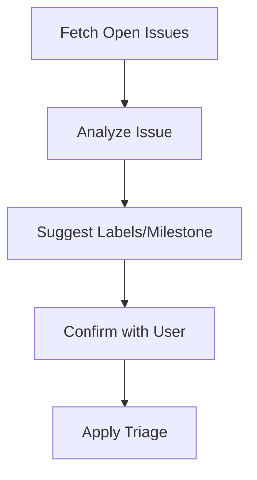

# GitHub Issue Wizard

Autonomously triage GitHub issues with a human-in-the-loop interactive CLI.

## Problem
Non-technical users struggle to triage GitHub issues due to lack of familiarity with labels, milestones, and technical jargon. This tool autonomously analyzes GitHub issues and provides an interactive wizard for non-technical users to confirm or adjust triage decisions.

## Solution
- **Autonomous Analysis**: Rule-based suggestions for labels/milestones based on issue title/body.
- **Interactive Wizard**: Human-in-the-loop confirmation for non-technical users.
- **Dry-Run Mode**: Simulate triage without applying changes.

## Usage

### Prerequisites
- Python 3.8+
- GitHub personal access token (with `repo` scope)

### Installation
```bash
pip install -r requirements.txt
```

### Run
```bash
# Dry-run (simulate triage)
python github_issue_wizard.py --repo "owner/repo" --token "your_github_token" --dry-run

# Live triage
python github_issue_wizard.py --repo "owner/repo" --token "your_github_token"
```

## Example
```bash
$ python github_issue_wizard.py --repo "octocat/Hello-World" --token "ghp_abc123" --dry-run

Issue #1342: Add dark mode support
URL: https://github.com/octocat/Hello-World/issues/1342

┏━━━━━━━━━━━━┳━━━━━━━━━━━━━━━━━━━━━━━━┓
┃ Type        ┃ Suggestion               ┃
┡━━━━━━━━━━━━╇━━━━━━━━━━━━━━━━━━━━━━━━┩
│ Label        │ enhancement              │
│ Milestone    │ v2.0                     │
└──────────────┴─────────────────────────┘

Apply label 'enhancement'? [Y/n]: Y
Set milestone to 'v2.0'? [Y/n]: Y
[DRY RUN] Would apply label: enhancement
[DRY RUN] Would set milestone: v2.0
```

## Technical Architecture

### Components
1. **GitHub API Client**: `PyGithub` for fetching issues and applying labels/milestones.
2. **Rule-Based Analyzer**: Regex-based keyword matching for suggestions.
3. **Interactive CLI**: `questionary` for human-in-the-loop confirmation.
4. **Dry-Run Mode**: Simulate triage without side effects.

### Flow


### Rules Engine
| Keyword          | Suggested Label     | Suggested Milestone |
|------------------|---------------------|---------------------|
| bug, error, crash| bug                 | None                |
| feature, request | enhancement         | None                |
| question, help   | question            | None                |
| v1.0             | None                | v1.0                |
| v2.0             | None                | v2.0                |

## License
MIT